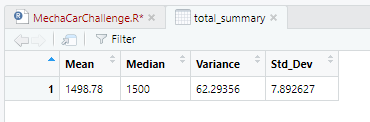
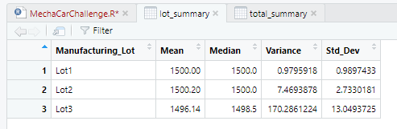
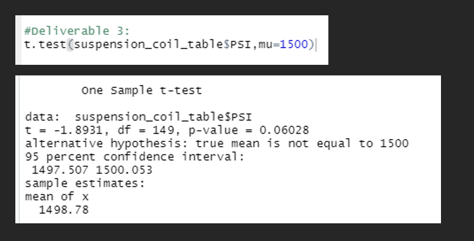
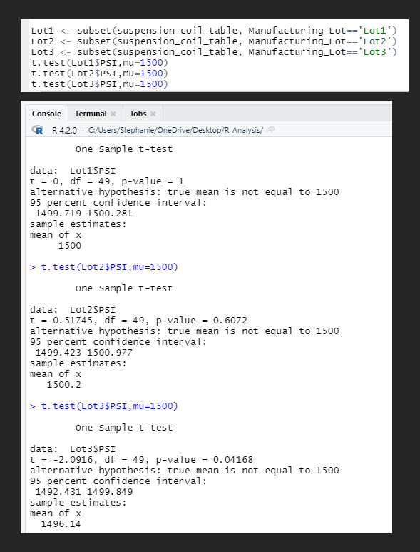

# MechaCar_Statistical_Analysis

#### Resources: *RStudio*

## Analysis Overview:
AutosRUs is utilizing a data analytics review based on previous, current and future launch efforts for a new line. The analysis 
will help to determine the success of the new prototype, the MechaCar. Currently suffereing from production troubles, with the 
analysis they hope to assist the manufacturing team to get the MechaCar into production.

## Linear Regression to Predict MPG

- Which variables/coefficients provided a non-random amount of variance to the mpg values in the dataset?
  - Both the vehicle length and ground clearance
- Is the slope of the linear model considered to be zero? Why or why not?
  - No, the slope is not equal to zero shown clearly by the p-value proving to be below 0.05.
- Does this linear model predict mpg of the MechaCar prototypes effectively? Why or why not?
  - This model does successfully predict the mpg of the MechaCar based on the multiple r-squared value of 0.71
  and the adjusted r-squared value of 0.68

## Summary Statistics on Suspension Coils
#### *Total Summary*

#### *Lot Summary*

#### The design specifications for the MechaCar suspension coils dictate that the variance of the suspension coils 
must not exceed 100 pounds per square inch. Does the current manufacturing data meet this design specification for 
all manufacturing lots in total and each lot individually? Why or why not?
  - While Lot 1 and 2 meet the variance requirements being that they do not exceed the 100 lbs per square inch, 
  Lot 3 falls outside that requirement by nearly double in the Lot Summary shown above. Due to the very low PSI for 
  for both Lot 1 & 2 we see that the total summary shows an overal variance below the required 100 which is slightly
  deceptive. 

## T-Tests on Suspension Coils
**No significant evidence to reject the null hypothesis based on the p-value of 0.06**

**For lot 1 & 2 we find no significant evidence to reject the null hypothesis due to a p-value of 1 and 0.6, however,
in contrast we will need to reject the null hypothesis for Lot 3 based on a p-value 0.04**

## Study Design: MechaCar vs Competition
- Tested Metrics:
  - Currently the most sought after specifications based on the current rising cost of fuel would be fuel efficiency as 
well as overall cost of the vehicle. 
- Null/Alternative Hypothesis:
  - Null: The MechaCar meets requirements to produce success in the market based on fuel efficiency and overall cost
  - Alternate: The MechaCar falls short meeting the cost effective requirements of the market
- Statistical Testing:
  - Likely the best statistic test to run would be a multiple linear regression to guage all of the required data in 
 one glance. 
- Data:
  - The most prevelant data would be fuel efficiency (city/hwy gas mileage), vehicle cost, and maintenance/repair costs

